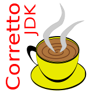

#  Amazon Corretto 8 /11

## ToC ##

* [Paketinfo](#paketinfo)
  * [Amazon Corretto](#about-corretto)
* [Paket erstellen](#paket_erstellen)
  * [Voraussetzungen](#voraussetzungen)
  * [Makefile und spec.json](#makefile_und_spec)
  * [pystache](#pystache)
  * [Verzeichnisstruktur](#verzeichnisstruktur)
  * [Makefile-Parameter](#makefile_parameter)
  * [spec.json](#spec_json)
* [Installation](#installation)
  * [Abhaengigkeiten](#abhaengigkeiten)
* [Allgemeines](#allgemeines)
  * [Properties](#properties)
  * [Aufbau des Paketes](#paketaufbau)
  * [Nomenklatur](#nomenklatur)
* [Lizenzen](#lizenzen)
  * [Dieses Paket](#licPaket)
  * [Oracle-Lizenzen](#licOracle)
  * [psDetail](#licPsDetail)
  * [GetRealName](#licGetRealName)
  * [7zip](#lic7zip)
  * [Logo](#logo)
* [Anmerkungen/ToDo](#anmerkungen_todo)


<div id="paketinfo"></div>

## Paketinfo ##

Dieses OPSI-Paket (bzw. dessen Quellen) fuer **Amazon Corretto 8** und  **Amazon Corretto 11**
deckt das *Java Development Kit* inklusive *Runtime* fuer die jeweiligen Releases
ab. Eine separate JRE wird nicht mehr angeboten.  
Waehrend Java 8 in einer 32- und 64-Bit-Version verfuegbar ist, liegt ab 
Versionen 11 nur noch eine Version fuer 64 Bit vor.

Teile dieser Dokumentation beziehen sich nicht ausschliesslich auf die erstellten 
OSPI-Pakete, sondern beruecksichtigen auch den Build-Prozess.


<div id="about_corretto"></div>

### Amazon Corretto ###
Amazon Corretto ist eine kostenlose, plattformübergreifende und produktionsbereite 
Distribution des Open Java Development Kit (OpenJDK). Corretto wird von langfristigem
Support begleitet, der Leistungs- und Sicherheitsverbesserungen umfassen wird. 
Corretto ist mit dem Java SE-Standard kompatibel zertifiziert und wird 
intern bei Amazon für viele Produktionsservices verwendet.


<div id="paket_erstellen"></div>

## Paket erstellen ##

Dieser Abschnitt beschaeftigt sich mit der Erstellung des OPSI-Paketes aus
dem Source-Paket und nicht mit dem OPSI-Paket selbst.


<div id="voraussetzungen"></div>

### Voraussetzungen ###

Zur Erstellung der OPSI-Pakete aus den vorliegenden Quellen werden neben den
**opsi-utils** noch weitere Tools benoetigt, die aus den Repositories der
jeweiligen Distributionen zu beziehen sind.
Das sind (angegebenen Namen entsprechen Paketen in Debian/Ubuntu):

* <code>make</code>
* python-pystache
* <code>curl</code> bzw. <code>wget</code>


<div id="makefile_und_spec"></div>

### Makefile und spec.json ###

Da aus den Quellen verschiedene Versionen des Paketes mit entsprechenden Anpassungen
generiert werden sollen (intern, O4I/DFN; testing/release) wurde hierfuer ein
**<code>Makefile</code>** erstellt. Darueber hinaus steuert **<code>spec.json</code>** 
die Erstellung der Pakete.

Im Idealfall sind beim Erscheinen einer neuen Release lediglich die jeweiligen
json-Files anzupassen.

Ohne explizite Angabe eines json-Files wird **<code>spec.json</code>** verwendet.
Dies erstellt generische Pakete ohne Angabe der Major-Release in der ProductId. 
Die <code>spec_corretto*.json</code> resultieren in Paketen, in denen
die Major-Release Bestandteil der ProductId ist. Dies ermoeglicht die parallele
Installation mehrerer Releases.


<div id="pystache"></div>

### pystache ###

Als Template-Engine kommt **<code>pystache</code>** zum Einsatz.
Das entsprechende Paket ist auf dem Build-System aus dem Repository der verwendeten
Distribution zu installieren.

Unter Debian/Ubuntu erledigt das:
> <code>sudo apt-get install python-pystache</code>


<div id="verzeichnisstruktur"></div>

### Verzeichnisstruktur ###

Die erstellten Pakete werden im Unterverzeichnis **<code>BUILD</code>** abgelegt.

Einige Files (control, postinst, setup.opsiscript) werden bei der Erstellung erst aus _<code>.in</code>_-Files
generiert, welche sich in den Verzeichnissen <code>SRC/OPSI</code> und <code>SRC/CLIENT_DATA</code> befinden.
Die <code>SRC</code>-Verzeichnisse sind in den OPSI-Paketen nicht mehr enthalten.


<div id="makefile_parameter"></div>

### Makefile-Parameter ###
Der vorliegende Code erlaubt die Erstellung von OPSI-Paketen fuer die Corretto-Releases
**8** und **11**. Die Auswahl erfolgt ueber das entsprechende *SPEC*-File.
Mitgeliefert werden '''spec.json''' (Corretto11,ProductId amazon-corretto)
sowie '''spec_corretto[8,11].json''' (ProductIds jeweils mit Major-Release):

> *<code>SPEC=&lt;spec_file&gt;</code>*

Ohne Angabe des Parameters werden die Pakete fuer Corretto 8 erstellt.

Das Paket kann mit *"batteries included"* erstellt werden. In dem Fall erfolgt 
der Download der Software beim Erstellen des OPSI-Paketes und nicht erst bei
dessen Installation:
> *<code>ALLINC=[true|false]</code>*

Standard ist hier die Erstellung des leichtgewichtigen Paketes (```ALLINC=false```).
Zuvor sollten jedoch die Installationspakte mit **```make download```** (ggf. unter
Angabe eines Spec-Files) heruntergeladen werden, da diese fuer die Berechnung
der Pruefsummen benoetigt werden.

Bei der Installation des Paketes im Depot wird ein eventuell vorhandenes 
```files```-Verzeichnis zunaechst gesichert und vom ```postinst```-Skript
spaeter wiederhergestellt. Diese Verzeichnis beeinhaltet die eigentlichen
Installationsfiles. Sollen alte Version aufgehoben werden, kann das ueber
einen Parameter beeinflusst werden:
> *<code>KEEPFILES=[true|false]</code>*

Standardmaessig sollen die Files geloescht werden.

OPSI erlaubt des Pakete im Format <code>cpio</code> und <code>tar</code> zu erstellen.  
Als Standard ist <code>cpio</code> festgelegt.  
Das Makefile erlaubt die Wahl des Formates ueber die Umgebungsvariable bzw. den Parameter:
> *<code>ARCHIVE_FORMAT=&lt;cpio|tar&gt;</code>*


<div id="spec_json"></div>

### spec.json ###

Haeufig beschraenkt sich die Aktualisierung eines Paketes auf das Aendern der 
Versionsnummern und des Datums etc. In einigen Faellen ist jedoch auch das Anpassen
weiterer Variablen erforderlich, die sich auf verschiedene Files verteilen.  
Auch das soll durch das Makefile vereinfacht werden. Die relevanten Variablen
sollen nur noch in <code>spec.json</code> angepasst werden. Den Rest uebernimmt *<code>make</code>*


<div id="installation"></div>

## Installation ##

Die Software selbst wird - sofern bei der Paketerstellung nicht anders vorgegeben - 
<u>nicht</u> mit diesem Paket vertrieben. Fuer die *"batteries included"*-Pakete 
entfaellt dieser Abschnitt.

Bei der Installation des Paketes im Depot erfolgt im <code>postinst</code>-Script 
der Download der Software vom Hersteller (Windows, 32 (sofern vorhanden) und 64 Bit).  
Ein manueller Download sollte dann nicht erforderlich sein.

Auf dem Depot-Server ist **curl** bzw. **wget** erforderlich.

Das Gesamtvolumen der herunterzuladenden Dateien betraegt je nach Paketvariante
zwischen **170** und **220 MByte**.

Da die Pakete von *lokalen Funktionen* Gebrauch machen, wird auf dem Depot-Server
*opsi-winst* mindestens in der Version 4.12(.0.13) vorausgesetzt.


<div id="abhaengigkeiten"></div>

### Abhaengigkeiten ###

Fuer weitere Hilfsprogramme ([psDetail](#licPsDetail) und 
[GetRealName](#licGetRealName)) das **.NET-Framework** ab der Version 3.5 benoetigt.


<div id="allgemeines"></div>

## Allgemeines ##


<div id="properties"></div>

### Properties ###

Je nach Art des erstellten Paketes und den Einstellungen in der <code>spec.json</code>
koennen die verfuegbaren Properties abweichen.

| Property | Type | Values | Default  | Multivalue | Editable | Description | Anmerkung |
|----------|:----:|--------|----------|:----------:|:--------:|-------------|------|
| set_env_java_home | bool |  | True | | | Set Environment JAVA_HOME and PATH to InstallDir of jdk or jre? |  |
| install_architecture | unicode | "32 bit", "64 bit", "sysnative" | "sysnative" | False | False | which architecture (32/64 bit) should be installed |  |
| custom_post_install | unicode | "none", "custom_test.opsiinc", "post-install.opsiinc" | "none" | False | True | Define filename for include script in custom directory after installation |  |
| custom_post_uninstall | unicode | "none", "custom_test.opsiinc", "post-uninstall.opsiinc" | "none" | False | True | Define filename for include script in custom directory after deinstallation |  |
| log_level | unicode | "default", "1", "2", "3", "4", "5", "6", "7", "8", "9" | "default" | False | False | Loglevel for this package |  |
| kill_running | bool |  | False |  |  | kill running instance (for software on_demand) | verfuegbar wenn in spec.json aktiviert |
| kill_applic | unicode |  |  | True | True | Instead of killing only applications of this package, kill also these running applications; requires "kill_running; use suffix '.exe' or '%' as wildcard | verfuegbar wenn in spec.json aktiviert |
| uninstall_before_setup | bool |  | True |  |  | Run uninstall before (re)installation | |


<div id="paketaufbau"></div>

### Aufbau des Paketes ###

* **<code>variables.opsiinc</code>** - Da Variablen ueber die Scripte hinweg mehrfach
verwendet werden, werden diese (bis auf wenige Ausnahmen) zusammengefasst hier deklariert.
* **<code>product_variables.opsiinc</code>** - die producktspezifischen Variablen werden
hier definiert
* **<code>helpers.opsifunc</code>** - Bibliothek mit lokalen (Hilfs-)Funktionen.
* **<code>setup.opsiscript </code>** - Das Script fuer die Installation.
* **<code>uninstall.opsiscript</code>** - Das Uninstall-Script
* **<code>delsub.opsiinc</code>**- Wird von Setup und Uninstall gemeinsam verwendet.
Vor jeder Installation/jedem Update wird eine alte Version entfernt. (Ein explizites
Update-Script existiert derzeit nicht.)
* **<code>checkinstance.opsiinc</code>** - Pruefung, ob eine Instanz der Software laeuft.
Gegebenenfalls wird das Setup abgebrochen. Optional kann eine laufende Instanz 
zwangsweise beendet werden.
* **<code>checkvars.sh</code>** - Hilfsscript fuer die Entwicklung zur Ueberpruefung,
ob alle verwendeten Variablen deklariert sind bzw. nicht verwendete Variablen
aufzuspueren.
* **<code>bin/</code>** - Hilfprogramme; hier: **7zip**, **psdetail**
* **<code>images/</code>** - Programmbilder fuer OPSI


<div id="nomenklatur"></div>

### Nomenklatur ###

Praefixes in der Produkt-Id definieren die Art des Paketes:

* **0_** oder **test_** - Es handelt sich um ein Test-Paket. Beim Uebergang zur Produktions-Release
wird der Praefix entfernt.
* **o4i** oder **dfn_** - Das Paket ist zur Verwendung im DFN-Repository vorgesehen.

Die Reihenfolge der Praefixes ist relevant; die Markierung als Testpaket ist 
stets fuehrend.

Suffix:

* ~dl - Das Paket enthaelt die Installationsarchive selbst nicht. Diese werden
erst bei der Installation im Depot vom <code>postinst</code>-Skript heruntergeladen.


<div id="lizenzen"></div>

## Lizenzen ##


<div id="licPaket"></div>

###  Dieses Paket ###

Dieses OPSI-Paket steht unter der *GNU General Public License* **GPLv3**.

Ausgenommen von dieser Lizenz sind die unter **<code>bin/</code>** zu findenden
Hilfsprogramme. Diese unterliegen ihren jeweiligen Lizenzen.


<div id="licAmazon"></div>

### Amazon-Lizenzen ###

> Corretto is released under the same open source license as OpenJDK, which is 
> licensed under the GNU Public License version 2 with the Class Path Exception 
> (GPLv2 with CPE). You can use Corretto as you would use OpenJDK.

Quelle: [Amazon Corretto FAQs](https://aws.amazon.com/corretto/faqs/#Licensing_and_Open_Source)

<div id="licPsDetail"></div>

### psDetail ###
**Autor** der Software: Jens Boettge <<boettge@mpi-halle.mpg.de>> 

Die Software **psdetail.exe**  wird als Freeware kostenlos angeboten und darf fuer 
nichtkommerzielle sowie kommerzielle Zwecke genutzt werden. Die Software
darf nicht veraendert werden; es duerfen keine abgeleiteten Versionen daraus 
erstellt werden.

Es ist erlaubt Kopien der Software herzustellen und weiterzugeben, solange 
Vervielfaeltigung und Weitergabe nicht auf Gewinnerwirtschaftung oder Spendensammlung
abzielt.

Haftungsausschluss:  
Der Autor lehnt ausdruecklich jede Haftung fuer eventuell durch die Nutzung 
der Software entstandene Schaeden ab.  
Es werden keine ex- oder impliziten Zusagen gemacht oder Garantien bezueglich
der Eigenschaften, des Funktionsumfanges oder Fehlerfreiheit gegeben.  
Alle Risiken des Softwareeinsatzes liegen beim Nutzer.

Der Autor behaelt sich eine Anpassung bzw. weitere Ausformulierung der Lizenzbedingungen
vor.

Fuer die Nutzung wird das *.NET Framework ab v3.5*  benoetigt.


<div id="licGetRealName"></div>

### GetRealName ###
**Autor** der Software: Jens Boettge <<boettge@mpi-halle.mpg.de>> 

Die Software **GetRealName.exe**  wird als Freeware kostenlos angeboten und darf fuer 
nichtkommerzielle sowie kommerzielle Zwecke genutzt werden. Die Software
darf nicht veraendert werden; es duerfen keine abgeleiteten Versionen daraus 
erstellt werden.

Es ist erlaubt Kopien der Software herzustellen und weiterzugeben, solange 
Vervielfaeltigung und Weitergabe nicht auf Gewinnerwirtschaftung oder Spendensammlung
abzielt.

Haftungsausschluss:  
Der Autor lehnt ausdruecklich jede Haftung fuer eventuell durch die Nutzung 
der Software entstandene Schaeden ab.  
Es werden keine ex- oder impliziten Zusagen gemacht oder Garantien bezueglich
der Eigenschaften, des Funktionsumfanges oder Fehlerfreiheit gegeben.  
Alle Risiken des Softwareeinsatzes liegen beim Nutzer.

Der Autor behaelt sich eine Anpassung bzw. weitere Ausformulierung der Lizenzbedingungen
vor.


<div id="lic7zip"></div>

### 7zip ###
Es gilt die Lizenz von http://www.7-zip.org/license.txt.


<div id="logo"></div>

### Logo ###
Anregung fuer das erstellte Logo war https://pixabay.com/de/java-pokal-kaffee-programmierung-151343.  
Die Variationen des Icon-Satzes fuer das OPSI-Paket wurden von mir unter Verwendung
weiterer freier Grafiken erstellt.


<div id="anmerkungen_todo"></div>

## Anmerkungen/ToDo ##

Bekannte Fehler:

-----
Jens Boettge <<boettge@mpi-halle.mpg.de>>, 2019-03-25 18:00:00 +0100
